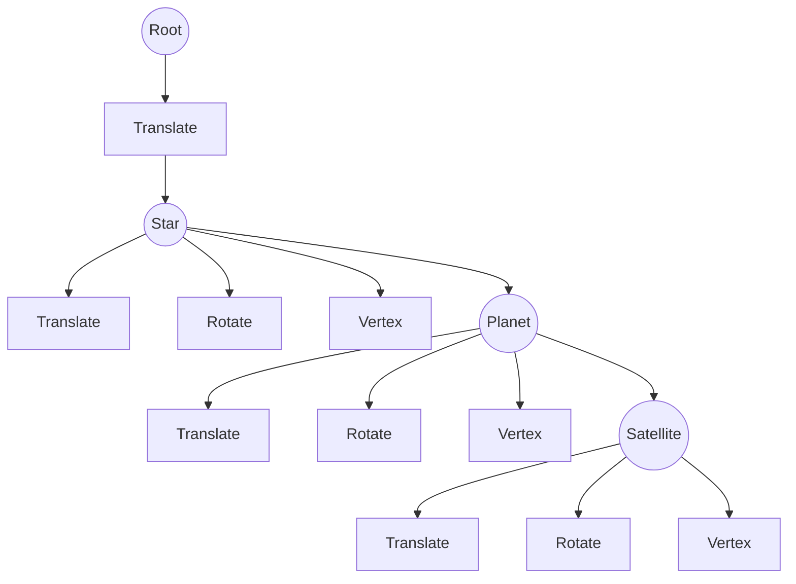
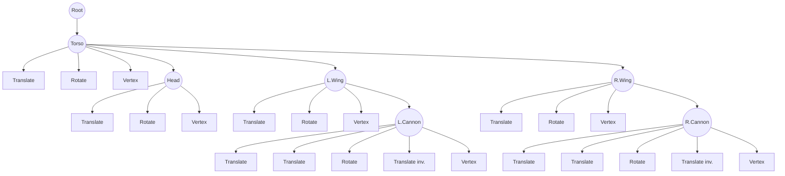
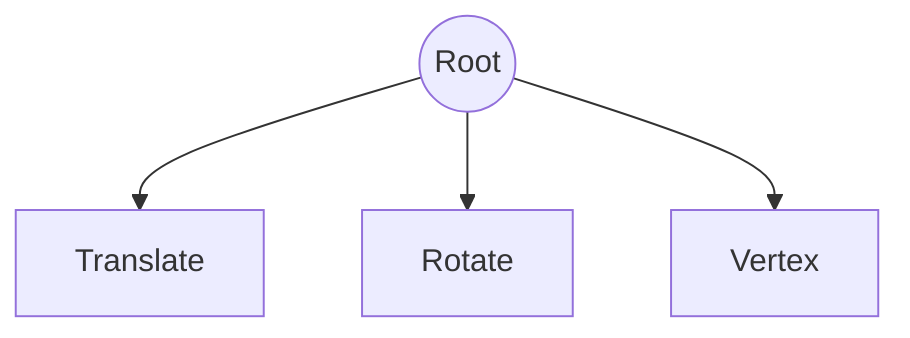
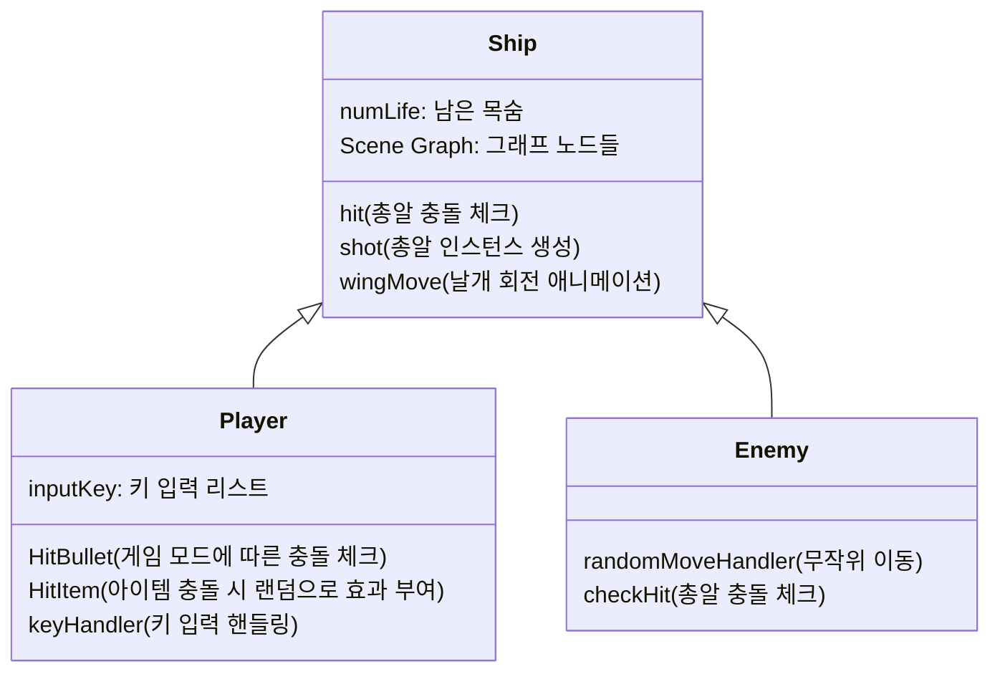

Assignment #2: 2D Animation
===
CSED451 Computer Graphics (Spring 2021) Assignment #2

`콤퓨타화상처리`
**최은수** (컴퓨터공학과, 20180050, ches7283),
**권민재** (컴퓨터공학과, 20190084, mzg00)

# 개요
 이 과제에서는 OpenGL을 활용하여 "Firi Games"의 "Phoenix 2(2016)"에 기반해서 구현한 Assignment 1을 개선해야한다. 이전에 비해 개선해야할 사항은 아래와 같다.

## Characters
 단순한 도형이었던 이전 과제와는 달리, cannon, wing이 각각 2개이고 body,  head가 각각 1개인 캐릭터를 디자인해야한다. 이때, wing과 cannon은 지속적으로 특정 각도 내에서 회전하는 애니메이션이 있어야 한다.
 
## Background
 검은색 배경 위에 항성, 행성, 위성이 각각 1개인 항성계 2개를 배치해야 하며, 이때 항성계가 다른 오브젝트를 가리지 않도록 해야한다.
 
## System
 적을 파괴할 때 아이템이 생성되어야 하며, 아이템을 먹을 경우에 플레이어의 총알의 개수가 1 증가해야 한다. 하지만 우리는 여기에 기능을 추가하여, 아이템을 먹을 경우에 일정 확률로 총알 개수가 1 증가되거나 1 감소되거나 게임이 오버되도록 구현하였다.

# 프로그래밍 환경
### 개발 환경
- Visual Studio 2019
### 라이브러리 버전
- OpenGL 4.1
- FreeGLUT 3.2.1
- GLEW 2.2.0
- GLM 0.9.9.9

# 프로그램 설계 및 구현
## Scene Graph
 이 프로그램에서 display 하는 과정을 일관성 있게 표현하기 위해서 Scene Graph를 이용해서 표현하였다. 모든 오브젝트를 Graph에 넣어서 표현하기 보다, 계층 구조를 가지는 오브젝트들에 대해서 Scene Graph를 각각 구성하였으며, 최종적으로 display할 때는 각 오브젝트가 가지고 있는 Scene Graph들과 Scene Graph를 가지지 않는 오브젝트들을 display하도록 구현하였다. 총알과 같이 계층 구조를 가지지 않는 오브젝트는 Scene Graph로 구현했을 때 계층화에서 오는 이득보다 오버헤드가 더 클 것으로 추측되었기 때문에 몇몇 오브젝트에 대해서는 Scene Graph로 구성하지 않았다.

### Stellar

### Ship (Player/Enemy)

## Class
### Node
- Scene Graph의 노드 역할을 수행하는 클래스.
- Left Child Right Sibling의 구조를 가지며, display 했을 때 Preorder 순으로 Node들의 가상 함수 _display 를 호출하여 Scene Graph가 의도한대로 작동할 수 있도록 구현하였다.
- 일반적인 노드는 `glPushMatrix` - `Child display` - `Sibling display` - `glPopMatrix`의 순서로 display 하지만, Group Node는 그의 Sibling 에게 이전의 특성이 전달되지 않도록 `glPushMatrix` - `Child display` - `glPopMatrix` - `Sibling display`의 순서로 display한다.
#### Vertex Node
- Vertex Node는 vertex들을 가지는 클래스로, `_display`가 불렸을 때 `glVertex`를 이용하여 vertex를 출력하는 역할을 수행한다.

#### Gradient Vertex Node
- Gradient Vertex Node는 vertex와 함께 그라데이션에 필요한 색 정보를 가지는 노드이다.
- `_display`가 불렸을 때, 자신이 가지고 있는 색깔 벡터의 크기와 vertex의 개수를 고려해서 색을 바꿀 간격을 정하고, 해당 간격에 맞게 색을 변경하면서 Vertex를 추가한다.
- 예를 들어, 출력해야할 vertex가 4개이고, 자신이 가지고 있는 색깔의 개수가 2개라면, 0번째와 2번째 vertex에서 색을 바꿔서 출력한다.

#### Translate Node
- Translate 노드는 `_display`가 호출되었을 때 `glTranslate`를 이용하여 스택에 Translate 변환을 추가하는 노드이다.

#### Rotation Node
- Rotation Node는 `_display`가 호출되었을 때 `glRotate`를 이용하여 스택에 Rotate 변환을 추가하는 노드이다.

### Game
- game mode (all-pass / all-fail)를 변경 및 관리하며 Player와 Enemy instance를 만들고 삭제하는 관리 기능을 수행한다. 
- 더불어, 게임에 관련정 정보를 출력하는 기능을 담당하고 있으며, 게임 종료 시 결과 또한 출력한다.

### Shape

- 이 클래스는 도형을 나타내는 가장 작은 단위로, Transtlate Node, Rotation Node, Vertex 노드를 가진다. Display할 때 Shape의 Group Node에서 display 메서드를 호출하여 preorder 순으로 출력할 수 있다.

### Ship

#### keyHandler
- Switch case 문을 이용하여 OpenGL keyboard handler로 부터 넘어온 정보를 활용하여 구현하였다.
- **상하좌우키** : window 밖을 넘어가는지 체크 한 후 triangle->move를 사용하여 이동
- **space_bar** : shot 함수를 호출하여 Bullet을 생성하고 글로벌 bullet list에 추가한다.

#### Hit check
- 총알이 우주선에 충돌하였는지 체크하는 루틴.
- 총알은 사각형이므로 네 점중 하나라도 우주선(삼각형) 내부에 존재하면 충돌로 간주한다.
- 삼각형의 한 점 T와 총알의 점 K가 삼각형의 나머지 두 점 A, B로 이루어진 직선너머 같은 쪽에 있는지를 모든 점에 대해 체크한다.
- $f(x,y) = (x-x1)(y1-y2) - (y-y1)(x1-x2)$ 에서 $f(T)\times f(K) > 0$인지 삼각형의 모든 점에 대해 체크한다.
- Enemy와 Player의 경우 Mode에 따라 목숨을 잃고, 아니고가 다르므로 각 class마다 method 정의가 조금 다르다.

### Orb
- Orb는 천체를 나타내는 클래스이다. 하나의 인스턴스는 Planet과 Satellite로 구성되어 있으며, Satellite는 다른 Orb 인스턴스를 받아서 연결하는 식으로 구현된다.
- Orb는 Planet과 Satellite 사이의 기본적인 Scene Graph를 구축하며, 이것들이 연결되어 항성계를 나타낸다.

### Stellar
- Stellar는 항성계를 나타내는 클래스이다. 하나의 인스턴스는 3개의 Orb 인스턴스 (Star, Planet, Satellite)를 가진다. 각 인스턴스를 알맞게 Orb의 Planet-Satellite 구조로 연결하고, Translate 노드의 Child로 Star의 그룹 노드를 연결하여 항성계가 정확한 위치에 표시될 수 있도록 Scene Graph를 구성했다.
- 일정 시간마다 각 orb가 회전하도록 만들어서 애니메이션을 구현하였다.
- 항성계가 우주선을 가리지 않도록 z 좌표를 활용하였는데, 이에 따른 깊이 테스트를 활성화해주기 위해서 프로그램이 처음 시작될 때 `glEnable(GL_DEPTH_TEST);`를 이용하여 깊이 속성을 쓸 수 있도록 활성화해주었고, 이에 따라 다른 창 속성도 Depth를 이용하도록 설정해주었다.

## Callback function
### Keyboard Event
- `glutKeyboardFunc`, `glutKeyboardUpFunc`,  `glutSpecialFunc`, `glutSpecialUpFunc`을 사용하여 키보드 이벤트를 처리하였다.
- Special Key
    - 방향키 입력을 일정한 캐릭터로 변환해서 플레이어 클래스에게 해당 키가 down 혹은 up 되었음을 알린다.
- Normal Key
    - 스페이스 입력을 일정한 캐릭터로 변환해서 플레이어 클래스에게 해당 키가 down 혹은 up 되었음을 알린다.
    - 모드를 변경하는 키인 `c`나 `f`가 입력되었을 경우에는 모드를 표시하는 전역 변수를 수정한다.

### TimerFunc
#### BulletMoveHit
- 0.3초마다 실행되며, enemy와 player가 쏜 bullet들을 일정 단위길이만큼씩 이동시킨다.
- 이동시킨 bullet이 window밖을 나갈 경우 삭제한다.
- 각 bullet들이 Enemy와 Player에 충돌했는지 체크하고 충돌한 bullet은 삭제한다.

#### BulletEnemyShot
- 3초마다 실행되며, enemy의 randomMove가 호출되며 좌/우/제자리 중 하나의 랜덤한 움직임을 한다.
- param value로 (value+1)%7을 넘겨줌으로써 움직임 7번 중 1번씩 bullet을 발사한다.

# 프로그램 실행 방법
### 우주선 이동
- 키보드의 **상하좌우** 키를 누르면 그에 따라 우주선이 상하좌우로 이동한다. 
- 우주선은 선체의 일부분도 window 밖으로 나갈 수 없으며 적이 있는 위치까지 제한없이 이동 가능하다.

### 총알 발사
- 키보드의 **space bar** 를 누르면 삼각형의 위쪽 꼭짓점을 통해 총알을 발사할 수 있다.
- 발사 가능한 총알 개수에는 제한이 없으며 이동과 동시에 총알 발사도 가능하다.

### 모드 변경
- **C** : 키보드의 'c' 키를 누르면 올패스 모드로 전환된다. 
- **F** : 키보드의 'f' 키를 누르면 올패일 모드로 전환된다.
모드 변경 키가 한 번 더 눌릴경우 다시 Normal 모드로 변경된다. 
해당 모드는 모두 화면에 표시되므로 시각적으로 확인할 수 있다.

# 예제
|기본 실행|아이템 로그 / 모드|게임 오버|
|-|-|-|
||||

**실행 시작** Normal mode, enemy 목숨 1, player 목숨 3

**스코어보드** 좌측 상단에서 enemy와 player의 남은 목숨과 총 갯수, mode, 아이템 로그를 확인할 수 있다.

**이동** 상하좌우 키보드 입력을 통해 이동

**목숨**
- enemy : 총 5마리로 뒤에 나올 때마다 목숨이 +1 더 많으며 한번에 나오는 충알의 수도 늘어난다. 각각 모두 색이 랜덤으로 지정된다.
- player : 목숨이 한개씩 줄어들 때마다 색깔이 변한다.

**아이템**
아이템은 초록색 사각형으로 나오며, 어떤 아이템을 먹었었는지 그 기록이 스코어보드에 기록된다. 아이템을 획득한 경우에 일정한 확률에 따라 아래 셋 중 하나가 실행된다.
- 한번에 나오는 총알 개수 증가. 단, 최대 총알 개수는 5개이다.
- 한번에 나오는 총알 개수 감소. 단, 최소 총알 개수는 1개이다.
- 폭탄으로 취급하여 Game Over 시킨다.

**Mode 변경** 주어진 키를 누를 경우에 all pass나 all fail 모드를 설정할 수 있고, 이는 좌측 상단의 스코어보드에서 확인할 수 있다.

**게임 종료**
게임이 종료되었을 때는 경우에 따라 3가지 메시지가 출력된다.
|Text|Situation|
|--|--|
|Win|적을 모두 제거했을 경우|
|Game Over - You're killed by Enemy X(|적에게 죽었을 경우|
|Game Over - BOMB exploded! That was not item X(|획득한 아이템이 폭탄이었을 경우|

# 토론
### callback 함수의 인자
- 해당 어싸인에서 본 팀은 구현을 위해 OpenGL의 여러 콜백함수 (`glTimerfunc`, `glDisplay`, `keyboard` 등) 를 사용하였다.
- openGL내부 콜백함수들은 외부에 선언되어있는 값들을 인자로 넘겨받을 수 없기 때문에 함수 내에서 우주선, 총알 등의 instance 들을 사용할 수 있는 방법에 대해 많은 고민을 하였다.
- 처음에는 JavaScript처럼 lambda 함수 리턴 을 활용하고자 하였지만 생각한대로 잘 구현되지 않아 외부에 static Global을 선언하여 활용하였다.
- 후에는 싱글턴방식을 차용하여 global 변수를 좀 더 객체지향적으로 포장하여 사용할 수 있을 것 같다.

# 추가 구현
## 그라데이션
 위 이미지에서 확인할 수 있는 것 처럼, 항성계의 각 천체에 그라데이션을 적용시켰다. 항성계의 천체들은 그라데이션을 표현할 수 있는 `Shape` 클래스인 `GradientShape`를 상속하여 만들어졌는데, 이 도형은 `GradientVertexNode`를 이용해서 만들어졌다. 위 Class 설명에서도 볼 수 있듯이, 이 노드에서는 각 Vertex마다 색을 지정해줄 수 있도록 구현하였다.
 또한 그라데이션을 구현하는데에는 `circleGradient`라는 함수를 구현해서 이용하였다. 이 함수는 시작 색깔과 끝 색깔을 넣어주면 시작부터 끝, 그리고 다시 끝부터 시작까지의 색깔 변화를 360단계로 나눠서 360개의 색깔이 담긴 벡터를 반환한다.
  마지막으로, 그라데이션이 정상적으로 출력되기 위해서 프로그램이 처음 시작될 때 `glShadeModel(GL_SMOOTH);`를 호출해서 쉐이더가 적용될 수 있도록 만들어주었다.
 이들을 모두 조합하여, `Orb` 클래스에서 각 천체를 `GradientShape`를 상속한 `GradientCircle`을 이용하여 나타내고, `Stellar` 인스턴스가 만들어질 때 `circleGradient`를 이용하여 각 천체마다의 그라데이션 색깔 벡터를 넣어줌으로서 항성계의 각 천체가 그라데이션으로 표현될 수 있도록 만들었다.

## Anti-Aliasing
 이전 과제에서도 스코어보드를 제작하였었는데, 그 때 글자가 예쁘게 표시되지 않았었다. 그 원인이 안티앨리어싱이 되지 않은 채로 글자가 표시 되는 것이라고 생각하여, OpenGL 초기 세팅을 통해 글자에 안티앨리어싱을 적용시켰다.
 - `glEnable(GL_BLEND)`;
     - 안티 앨리어싱이 구현되기 위해서는 각 픽셀에 투명도가 적용되어야하고, 투명도가 적용된다는 뜻은 뒤의 오브젝트와 색깔이 섞일 수 (blending) 될 수 있어야 함을 의미한다. 그렇기 때문에 `GL_BLEND`를 활성화시켜주어야 한다.
- `glBlendFunc(GL_SRC_ALPHA, GL_ONE_MINUS_SRC_ALPHA)`;
    - glBlendFunc은 블렌딩 될 경우에 그 정도를 결정하는 함수이다. 첫번째 인자에 위에 겹쳐지는 오브젝트의 블렌딩 비율 함수가, 두번째 인자에는 기존에 있던 오브젝트의 블렌딩 비율을 결정하는 함수가 들어간다.
    - 현재 위와 같은 경우에서는, 위에 올라가는 오브젝트의 알파 값 (투명도)가 40%라면, 해당 색의 블렌딩 비율은 40%가 되고 기존에 있던 오브젝트의 블렌딩 비율은 60%가 된다.
    - 즉, 현재 설정이 가장 일반적인 블렌딩 방식이라고 할 수 있다.
 - `glEnable(GL_LINE_SMOOTH)`;
     - 선 형태의 오브젝트에 안티앨리어싱을 활성화시키는 인자이다. 현재 안티앨리어싱 하고자 하는 주 목표가 글자인데, 현재 스코어보드는 Stroke를 이용해서 글자를 출력하고 있기 때문에 해당 플래그를 통해 안티앨리어싱 할 수 있다.
     - `GL_POLYGON_SMOOTH`를 이용하면 게임 내의 다른 폴리곤들에도 안티앨리어싱을 적용시킬 수 있지만, 이를 적용시켰을 때 오히려 오브젝트가 움직일 때 그래픽이 거슬리는 부분이 있었기 때문에 폴리곤에는 적용하지 않았다.
  
  
 
## 스코어보드
 기존 과제에서 구현하였던 스코어보드에 아이템 로그를 표시하는 기능을 추가하였다. 획득한 아이템에 따라 스코어보드의 아이템 로그에 `Bullet INCR <MAX 5> :)`, `Bullet DESC <MIN 1> :(`, `BOMB! X(`가 추가되도록 만들었다. 아이템이 폭탄이었을 경우 즉사하기 때문에, `BOMB! X(`이 아이템 로그에 떠 있는 것은 보기 힘들 것이다. 그래서 추가적으로 게임 오버되었을 때 적에 의해 죽은 것인지 아니면 폭탄에 의해 죽은 것인지 표시하는 기능도 추가하였다.
 
## 멀티 키 입력
 기존 과제에서 구현했던 멀티 키 입력을 그대로 구현하였다. 자세한 사항은 이전 과제의 보고서에서 확인할 수 있다.

# 결론
1. Scene Graph를 이용하여 계층이 있는 오브젝트들의 출력을 체계적이고 일관성 있게 할 수 있었다.
2. Z 좌표를 이용해서 각 오브젝트에 깊이를 부여할 수 있었다.
3. $TRT^{-1}$ 변환을 이용하여 축을 중심으로 하는 

# 개선 방향
### 그라데이션 최적화
현재는 그라데이션 색깔 벡터를 만들 때 360개의 원 Vertex에 대해서 360개의 색깔 정보를 만들어서 주는 방식으로 구현되어 있기 때문에, 장기적으로 봤을 때는 성능 상 문제가 될 수 있을 것 같다. 그래서 색깔 정보를 줄여서 최적화시킬 필요성이 있다.
또한, 원을 출력할 때 GL_POLYGON을 이용하고 있기 때문에 그라데이션이 일정하게 출력되고 있지 못한데, 앞으로 `GL_TRIANGLE_FAN`을 이용하여 원을 출력하도록 개선해야할 것이다.
 
 
# 참고문헌
- OpenGL Docs (https://www.khronos.org/opengl/)